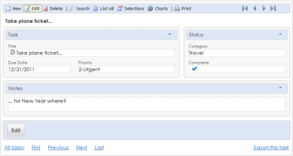
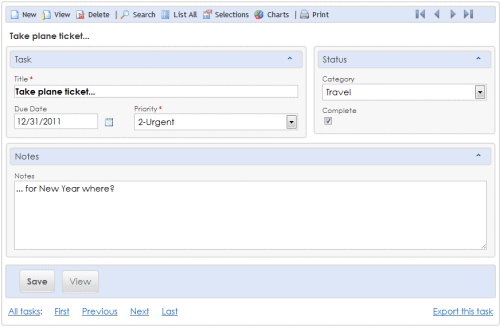
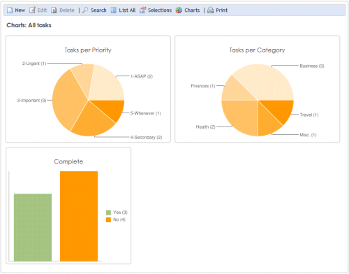
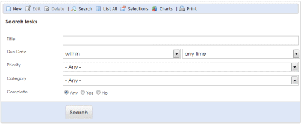
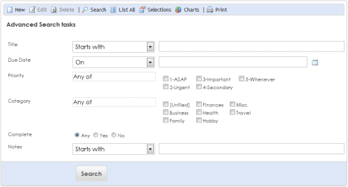
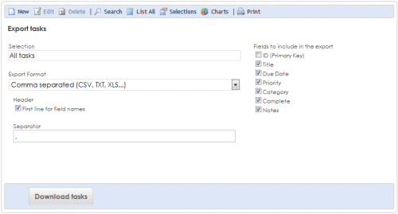
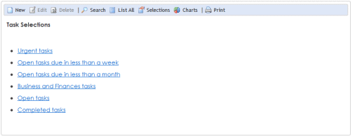

### This repository is not maintained anymore.

# Evolutility-ASP.net

Evolutility is a generic web user interface for CRUD (Create, Read, Update, Delete) applications running on ASP.net, and SQL Server or MySQL. 

It is entirely metadata driven, and can adapt to different database structures. It may behave like an address book, a task list, a photo album, or anything you may want to build. It is ideal to quickly build functional components for database web applications or web site administration pages.

With Evolutility the user interface (e.g. fields titles, positions, visual groups, CSS classes) and its database mapping (e.g. tables, columns, stored procedures) are not defined in the code but in external metadata (stored as XML files or in the database). Evolutility web control can be nested into any ASP.net page. It will generate at run-time all necessary web forms, manage user interaction, and database CRUD (create, read, update, delete) operations automatically.

Demos: 
[To Do list](http://evolutility.com/demo/demo_ToDo.aspx),
[AddressBook](http://evolutility.com/demo/demo_addressbook.aspx),
[Wine Cellar](http://evolutility.com/demo/demo_WineCellar.aspx),
[Restaurants list](http://evolutility.com/demo/demo_Restaurant.aspx).

[Documentation](http://evolutility.com/doc/doc.aspx)

Hosted at [SourceForge](https://sourceforge.net/projects/evolutility/) since 2008.

## Pages generated at run-time

### View 
Displays all fields for viewing, 1 record at a time. 

### Edit 
Displays all fields for editing, 1 record at a time. 

### List 
Displays the most important fields for multiple rows of records.

### Charts 
Draws a few charts of the data.

### Search 
Query by example form for searching records.

### Advanced Search 
Form for advanced queries such as "phone number start by 415" or "for categories Finances and Business"... 

### Export
Export of selections in standard formats (Excel, HTML, CSV, XML, or SQL), one or several records at the same time.   

### Mass Update 
Update for multiple records at once.

### Selections 
List of canned queries.

## Installation

To run the Evolutility sample applications:

- Copy the directory "Evolutility__Web" (which contains the web site) to your web server.
- Attach the database (located in the "Evolutility__Web/App_Data" directory of the web site). 
   You may also create a new database and run the SQL scripts (located in "Resources/SQL/").
- If necessary, change the database connection string in the "appSettings" section 
    of the Web.config file (or in specific ASPX page). 

Default login/password:

 - For the multi-users demos, use John/John or Mary/Mary as your login/password.
 - For EvoDico, use EVOL/LOVE as your login/password.

More about [installing Evolutility](http://evolutility.com/doc/EvoDoc_Install.aspx).

## Other implementations of Evolutility

[Evolutility-UI-React](https://github.com/evoluteur/evolutility-ui-react) - Model-driven Web UI for CRUD using React.

[Evolutility-UI-jQuery](https://github.com/evoluteur/evolutility-ui-jquery) - Model-driven Web UI for CRUD using jQuery and Backbone (for REST or localStorage).

[Evolutility-Server-Node](https://github.com/evoluteur/evolutility-server-node) - RESTful Micro-ORM for CRUD and more, written in Javascript, using Node.js, Express, and Postgres.

## License

Evolutility-ASP.net is released under the [AGPLv3 license](http://github.com/evoluteur/evolutility-asp.net/blob/master/License_AGPL-3_0.txt).

Copyright (c) 2020 [Olivier Giulieri](https://evoluteur.github.io/).
